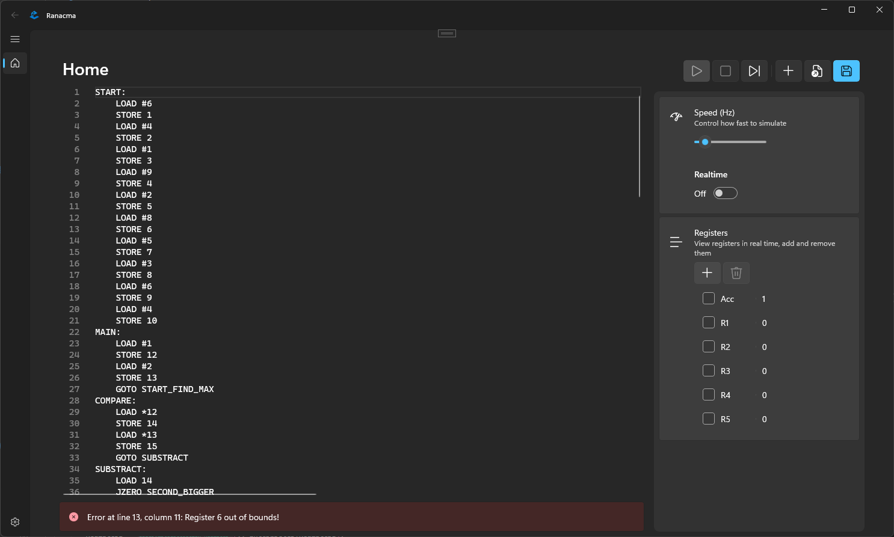

# RandomAccessMachine

RandomAccessMachine is a project that simulates a random access machine (RAM). It includes an interpreter for executing instructions, a demo application, and various components for managing settings and services.

There is also a feature-rich text editor that supports syntax highlighting (soon™), auto-save, and localization. The editor is built using the Windows Community Toolkit and Microsoft.UI.Xaml.

## Project Structure

- **RandomAccessMachine.App**: The main application project.
- **RandomAccessMachine.Backend**: The backend logic for the random access machine.
- **RandomAccessMachine.Demo**: A demo application that references the backend project.

## Getting Started

### Prerequisites

- .NET 9.0 SDK
- Visual Studio 2022
- Windows 11 Build 22621 or later

## Features
- **Tokenizer**: Breaks down a string into tokens for parsing.
- **Parser**: Converts a sequence of tokens into an abstract syntax tree.
- **Label Resolver**: Resolves label references to labels.
- **Bounds Checker**: Verifies that memory addresses are within bounds.
- **Interpreter**: Executes instructions for the random access machine.

### Feature-rich Text Editor
- **Auto-Save**: Automatically saves your work at specified intervals.
- **Startup Settings**: Configures the application to open the last file on startup.
- **Localization**: Supports multiple languages for UI elements.

## Contributing
Contributions are welcome! Please fork the repository and submit a pull request.

## License
This project is licensed under the MIT License. See the [LICENSE](LICENSE.txt) file for details.

## Acknowledgements
- [CommunityToolkit.WinUI](https://github.com/CommunityToolkit/WindowsCommunityToolkit)
- [Microsoft.UI.Xaml](https://github.com/microsoft/microsoft-ui-xaml)
- [OneOf](https://github.com/mcintyre321/OneOf)